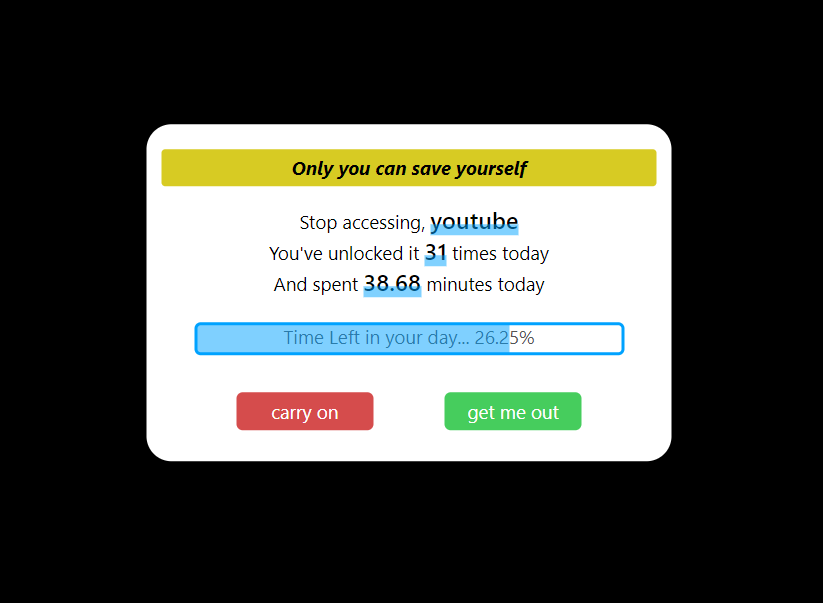
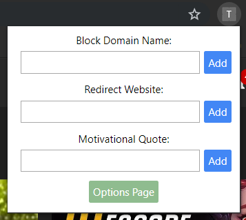
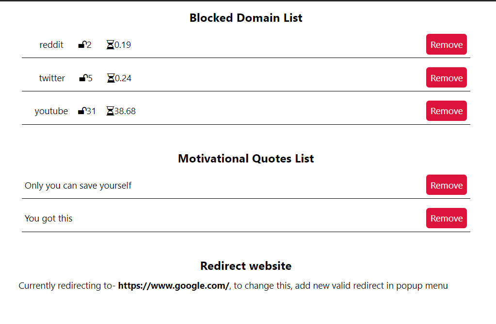
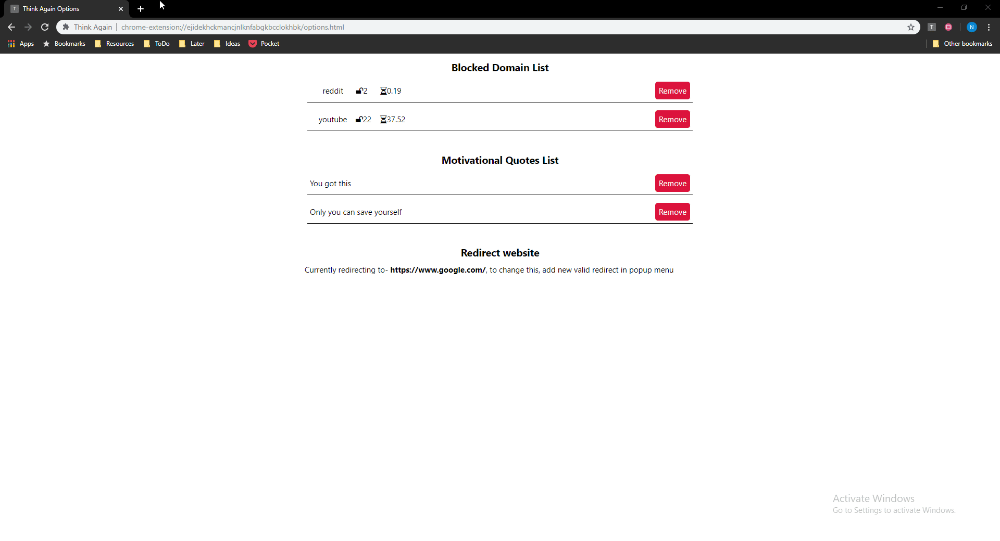
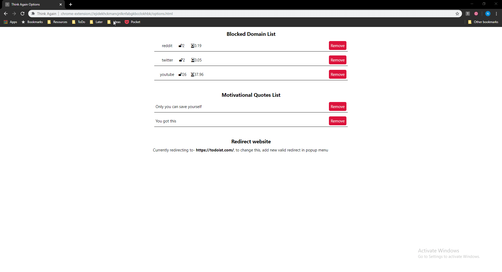
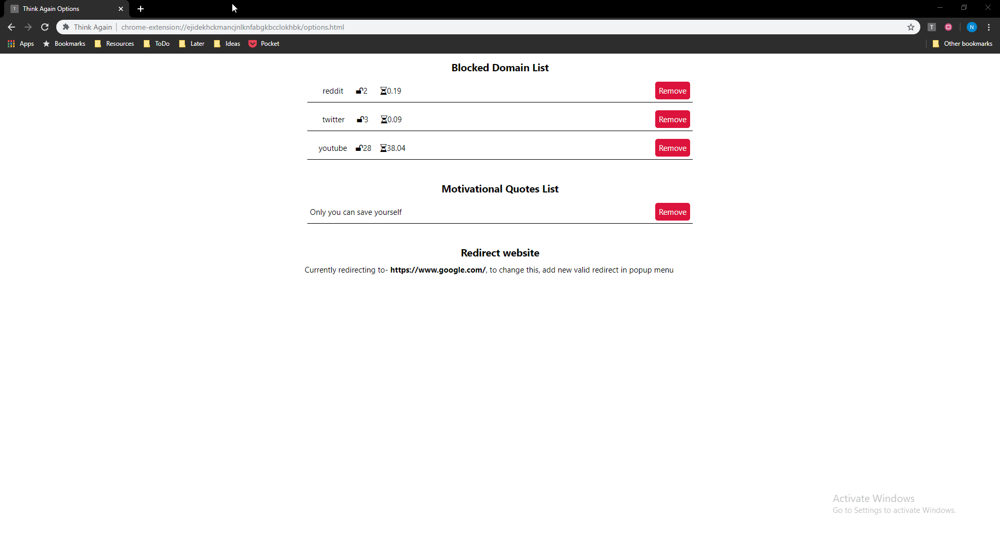

# Think-Again
A chrome extension to, well pause and think again before entering that rabbit hole

## Why ?
Many a times I have found myself mindlessly roaming on the internet, seeping deeper and deeper into some rabbithole, losing track of time. And when finally the day ends, look back and regret, how time flew by and I couldn't do anything.  
Upon some realisation and research I realised that, if given a pause and time to think about something, people tend to make more calculated response, rather than go with their gut feeling, and hence this idea was born.

## What ?  
This chrome extensions, maintains a list of `blocked domains` and pauses user everytime, they try to access it either by navigating to it, or switching to it. Along with also provides some much needed information
1. A personalized motivation quote
2. Domain accessed
3. Number of times this domain has been accessed
4. Amount of time spent on this domain
5. Percentage of day left
6. And finally buttons *(pills)* to choose from  

## How to install ?
1. Open the "Extensions" page `chrome://extensions/` in the browser and turn on the `Developer mode`.
2. Click on the `Load unpacked` button and select the directory where the build extension is placed.

## Components
- This can be seen in the screenshot below `message` -
 

- This gets active when a new tab is opened and navigates to a blocked domain, or when switching to a tab already having blocked domain  
- Finally 2 buttons are provided, one to move forward to the blocked domain, and the other to go some productive website, mentioned by the user.  
- These things, which are mentioned by the user, the blocked domains, redirect url, quotes can all be provided through the `popup` which opens on clicking the `Think Again` icon in the menu bar    
    

- Once an item is inserted in the `popup` can remove those and view those in the `options` page, which can be accessed by the button in the popup.
  

- As can be seen `options` page contains list of `blocked domains`, `quotes` and `redirect url`, and all can be added using `popup`

## Features
- Add `domains` to block
- Add `motivational quotes` to display for blocked domains
- Add `redirect url` to get out of these blocked domains
- `Reset` the data for each blocked domain, at midnight
- `Sync` this data across google chrome devices
- Block on `navigating` or `switching`

## Screen Recordings
### Blocked Domains

### Redirect Link

### Motivational Quotes

## To Do
- [ ] Timer for blocked websites  
- [ ] Activate icon on blocked websites

## Contact & Additional Info
- For any bugs or suggestion can mail at neel12@somaiya.edu
- If interested added writeups can be found <a href="https://www.notion.so/Think-Again-e996cc572aee4875ae2e33957a4f62d1" target="_blank"> here </a>
